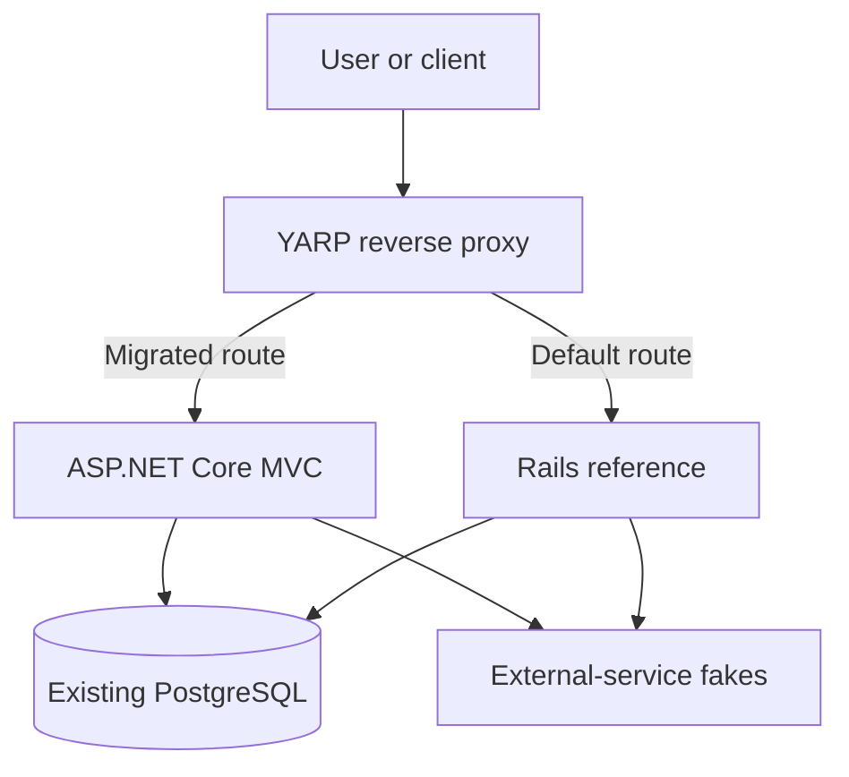
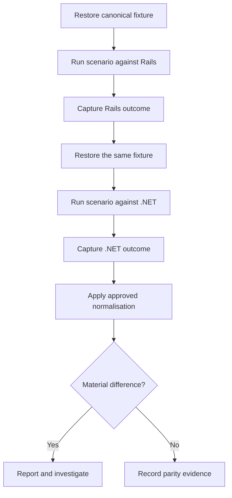
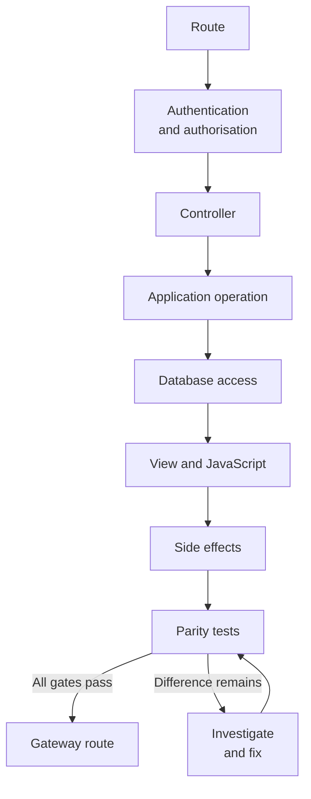
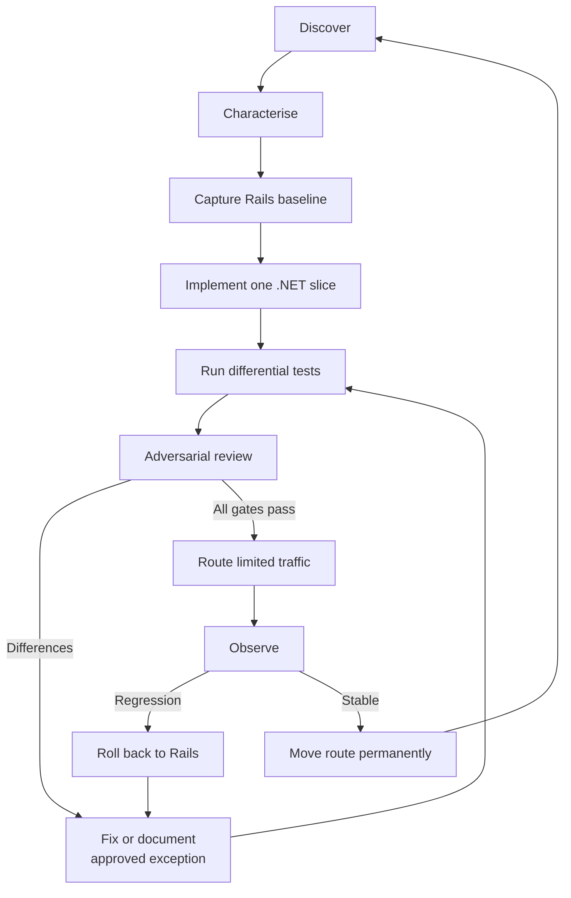

# Rails to ASP.NET Core migration strategy

> [!abstract] Executive summary
> Migrate the Rails application incrementally, one complete user journey at a time. Rails remains the behavioural source of truth. A shared parity harness—not an AI confidence score—decides whether a route is ready to move to ASP.NET Core.

The objective is not a line-for-line rewrite. It is to replace the implementation while preserving everything that users and connected systems can observe.

## Core principles

1. **Define parity in observable terms.** Replace “exactly the same” with explicit, testable contracts.
2. **Preserve the frontend.** Port templates; do not redesign the service during the migration.
3. **Treat the Rails repository and running application as evidence.** Record unknown behaviour instead of guessing.
4. **Build the parity harness before porting features.** The harness must test either application independently.
5. **Migrate vertical slices.** Each slice must be complete, testable, deployable and reversible.
6. **Use progressive routing.** Send approved routes to .NET and leave everything else on Rails.
7. **Let evidence gate release.** A slice moves only when every material difference is explained.

> [!warning] Behavioural source of truth
> Rails is the source of truth even when its behaviour appears awkward or accidental. Correct that behaviour only through a separate, approved change. Do not reproduce a confirmed security vulnerability without an explicit security decision.

## 1. Define “the same” as observable parity

Binary-identical output is neither realistic nor useful: Rails and ASP.NET Core have different runtimes. The acceptance target is **identical externally observable behaviour**, after a small, reviewed set of normalisations for genuinely volatile values.

| Contract | What must match |
|---|---|
| Request | URL, path, HTTP method, query parameters, form field names and content negotiation |
| Response | Status, redirect location and chain, relevant headers, content type and cache behaviour |
| Identity | Authentication, authorisation, CSRF outcome, cookies, expiry and session behaviour |
| Presentation | HTML structure, text, classes, IDs, `data-*` attributes, CSS, JavaScript, fonts and images |
| Interaction | Responsive layout, focus, hover, expanded states, keyboard operation and accessibility |
| Validation | Accepted inputs, message text, message order, handling of missing, blank and malformed values |
| Data | Inserts, updates, deletes, defaults, generated values, relationships and transaction rollback |
| Side effects | Emails, jobs, external calls, webhooks, files, cache operations and analytics events |

Only deliberately variable values—such as request IDs, timestamps and anti-forgery tokens—may be normalised. Every normalisation must be narrow, documented and reviewed.

> [!failure] Not an acceptance criterion
> “The new code looks roughly equivalent”, “the happy path works” and “the screenshots are close enough” do not establish parity.

## 2. Target operating model

The migration uses a strangler pattern: one public entry point, two application runtimes and a route-level switch.



Initially, every business route goes to Rails. A route moves to .NET only after its full vertical slice passes the parity gates. Rollback is then a small routing configuration change rather than an emergency redeployment.

### Authentication boundary

Rails signed or encrypted session cookies are not automatically readable by ASP.NET Core. Before moving an authenticated route, choose and test one of these strategies:

- migrate the whole authenticated boundary together;
- keep authentication-dependent routes on Rails temporarily;
- use a deliberately designed shared session bridge; or
- move both applications to a shared external identity provider.

Do not assume that proxying alone makes sessions interoperable.

## 3. Preserve the frontend

Exact visual fidelity is easiest when the existing frontend remains intact.

For a server-rendered Rails application using ERB:

- copy the existing CSS, JavaScript, images and fonts unchanged;
- preserve HTML element order and nesting;
- translate only the ERB expressions and control flow into Razor;
- retain class names, IDs, `data-*` attributes and form field names;
- retain Stimulus, Turbo and other existing JavaScript unless a proven incompatibility requires a change; and
- do not introduce Blazor, React or a new design system as part of the migration.

ASP.NET Core MVC views are HTML templates with embedded Razor markup, and ordinary HTML in a Razor file is rendered unchanged. That makes MVC with Razor the natural target for a server-rendered Rails UI ([ASP.NET Core MVC views](https://learn.microsoft.com/en-us/aspnet/core/mvc/views/overview?view=aspnetcore-10.0), [Razor syntax](https://learn.microsoft.com/en-us/aspnet/core/mvc/views/razor?view=aspnetcore-10.0)).

If React, Vue or another standalone frontend already owns the UI, leave it untouched and reproduce only the backend contracts it consumes.

> [!tip] Separate migration from improvement
> Record desired redesigns, dependency upgrades and behaviour fixes in a backlog. Mixing them into a parity migration makes differences harder to explain and rollback harder to trust.

## 4. Build an evidence-backed application map

Before generating .NET business code, analyse the Rails repository and create a traceable inventory. Rails routes connect incoming requests to controller actions, so `config/routes.rb` and the resolved route table are the starting points—not the whole map ([Rails routing guide](https://guides.rubyonrails.org/routing.html)).

Inventory all of the following:

- routes, constraints, precedence, controllers, actions and filters;
- models, associations, validations, scopes, enums and callbacks;
- tables, columns, indexes, foreign keys, constraints and defaults;
- layouts, ERB views, partials, helpers, presenters and components;
- forms, parameter shapes, validation text and error ordering;
- authentication, authorisation, cookies, CSRF and session state;
- Active Job, Sidekiq and scheduled jobs, including retry rules;
- Action Mailer templates, URL generation and delivery rules;
- uploads, object storage, caching and Redis behaviour;
- external APIs, webhooks, CMS calls and notification services;
- environment variables, Rails credentials and feature flags;
- middleware, error handling, security headers and content negotiation; and
- unit, controller/request, integration and system tests.

Rails supports evidence at several test levels, including unit, functional, integration and system tests ([Testing Rails Applications](https://guides.rubyonrails.org/testing.html)). Existing tests are evidence, but lack of a test is not evidence that a behaviour does not exist.

### Evidence standard

Every claimed behaviour must include at least one of:

1. a repository file and line range;
2. an existing test that demonstrates it; or
3. an observed request against the running Rails application.

Mark unsupported or conflicting behaviour as **unknown**. Never fill an evidence gap from a name, comment or Rails convention alone.

A useful behaviour record contains:

| Field | Purpose |
|---|---|
| Behaviour | A single observable rule |
| Inputs and preconditions | State needed to reproduce it |
| Expected output | HTTP, UI or integration outcome |
| Database effect | Rows and transaction behaviour |
| Other side effects | Jobs, email, cache, files and calls |
| Evidence | File and lines, test, or captured observation |
| Confidence | Confidence in the evidence, not in the author |
| Coverage | Characterisation scenario that proves the rule |

## 5. Build the parity harness first

Create one implementation-independent suite that accepts target base URLs, for example:

```text
RAILS_BASE_URL=https://rails.local
DOTNET_BASE_URL=https://dotnet.local
GATEWAY_BASE_URL=https://gateway.local
```

The same scenario definitions must run against Rails and .NET. Avoid sharing production implementation code with the harness; shared defects can otherwise create false parity.

### Differential test sequence



Read-only scenarios may share a seeded fixture. Write scenarios must run sequentially against separately restored database states. Never let both applications mutate the comparison database concurrently.

### HTTP parity

Compare:

- status code and content type;
- redirect destination and full chain;
- selected headers and cache behaviour;
- cookies and their attributes;
- normalised HTML or JSON; and
- authentication, authorisation and CSRF outcomes.

### Visual and interaction parity

Generate golden screenshots from Rails and compare the .NET output with Playwright. Playwright provides screenshot reference generation and pixel comparison, but rendering varies by operating system, browser, fonts and environment. Generate and compare baselines in the same deterministic container ([Playwright visual comparisons](https://playwright.dev/docs/test-snapshots)).

Cover at least:

- desktop and mobile breakpoints;
- signed-in and signed-out states;
- empty, populated, loading and error states;
- validation errors and unusually long content;
- focus, hover and expanded states;
- keyboard-only journeys; and
- JavaScript-enhanced interactions.

Do not raise tolerances until a failing page passes. Mask only content proven to be dynamic, and record why the mask is necessary.

### Data parity

For each write scenario, compare:

- inserted, updated and deleted rows;
- relationship and audit-record changes;
- database and application-generated values;
- timestamps after approved normalisation;
- transaction boundaries and rollback; and
- enqueued jobs created by the transaction.

### Side-effect parity

Capture and compare:

- emails and personalisation payloads;
- background jobs and retry metadata;
- external HTTP calls and webhooks;
- file and object-storage writes;
- cache writes and invalidations; and
- analytics events.

Use local fakes, simulators or test endpoints. Never use production credentials or send migration-test effects to real users.

## 6. Create the .NET foundation

As of 14 July 2026, .NET 10 is the active LTS release and is supported until 14 November 2028 ([official .NET support policy](https://dotnet.microsoft.com/en-us/platform/support/policy/dotnet-core)). Use .NET 10, ASP.NET Core MVC and Razor unless the project has an approved alternative.

A reasonable initial structure is:

```text
src/
  Application.Web/
  Application.Application/
  Application.Domain/
  Application.Infrastructure/

tests/
  Application.UnitTests/
  Application.IntegrationTests/
  Application.ParityTests/
  Application.PlaywrightTests/

migration/
  inventory/
  contracts/
  evidence/
  parity-reports/
  decisions/
```

This is a starting shape, not a mandate to invent an elaborate architecture. Parity comes before architectural perfection; add abstractions only when observed behaviour needs them.

### Keep PostgreSQL initially

Do not change the application language and database platform at the same time.

EF Core can reverse-engineer entity classes and a `DbContext` from the existing schema. The generated model is a starting point: schema reverse engineering cannot recover every domain concept or application behaviour ([EF Core reverse engineering](https://learn.microsoft.com/en-us/ef/core/managing-schemas/scaffolding/)).

During coexistence:

- designate one application as the schema-migration owner—normally Rails at first;
- never let Rails and EF migrations independently evolve the schema;
- preserve existing table names, column names and storage representations;
- add new columns through backwards-compatible stages;
- validate constraints and database defaults directly, not just through ORM mappings; and
- test every supported write path from both applications.

## 7. Route progressively with YARP

YARP represents proxy configuration as routes and destination clusters. More-specific routes take precedence, and explicit route order can be configured when needed ([YARP configuration](https://learn.microsoft.com/en-us/aspnet/core/fundamentals/servers/yarp/config-files?view=aspnetcore-10.0)).

Use two clusters:

- **Rails:** the default catch-all destination;
- **.NET:** only routes that have passed every migration gate.

For each route switch:

1. add the exact path and HTTP methods to the .NET route;
2. retain the Rails catch-all;
3. prove the migrated route reaches .NET through the gateway;
4. prove neighbouring and unrelated routes still reach Rails;
5. verify host, path, query string, method and forwarded headers; and
6. exercise the documented rollback change.

> [!danger] No public backend override
> Do not expose a request header or query parameter that lets an external caller choose the backend. Route selection must be controlled by reviewed gateway configuration.

## 8. Migrate complete vertical slices

Do not port all models, then all controllers, then all views. That creates months of incomplete code with no releasable behaviour.

Each slice follows a complete journey:



A sensible risk-based order is:

1. public read-only pages;
2. simple search and filtering;
3. basic forms and validation;
4. authenticated read-only pages;
5. database writes and multi-step workflows;
6. external integrations;
7. background and scheduled jobs;
8. authentication and account management; and
9. administrative and unusual legacy behaviour.

Order slices by evidence, coupling and operational risk rather than code-folder layout. Every slice must remain independently releasable and reversible.

## 9. Rails-to-.NET risk hotspots

These areas are especially easy to translate into plausible but incorrect C#:

| Area | Typical parity risk |
|---|---|
| Callbacks and scopes | Different execution order, hidden writes or omitted filtering |
| Validation | Different order, wording, conditional rules or duplicate handling |
| Parameters | `nil`, missing and empty strings collapse into one .NET value |
| Associations | Polymorphism, STI, nested attributes and dependent actions are lost |
| Storage types | Enums, serialized/JSON columns and decimals map differently |
| Time | Time-zone conversion, daylight-saving boundaries and timestamp precision differ |
| Transactions | Commit timing, rollback and after-commit work move boundaries |
| Database behaviour | Defaults, constraints, sequences, counter caches and locking are overlooked |
| HTTP and forms | Route precedence, model binding, CSRF and content negotiation diverge |
| Identity | Cookie signing, encryption, expiry and session storage are incompatible |
| Jobs and mail | Retry policy, URL generation, locale and delivery timing change |
| Caching | Cache keys, expiry and invalidation no longer match |
| Language | Pluralisation, ordering and truthiness assumptions change |

Treat each as a prompt to add evidence and tests—not as proof that a defect exists.

## 10. Give AI constrained roles

Use focused, reviewable passes instead of asking one autonomous agent to rewrite the application.

| Role | Responsibility | Required output |
|---|---|---|
| Archaeologist | Trace one slice through Rails | Routes, files, dependencies, callbacks, tests, risks and unknowns with evidence |
| Characterisation-test writer | Prove current Rails behaviour before conversion | Executable scenarios and captured baselines |
| Migration implementer | Build only the selected .NET slice | Working slice, focused .NET tests and no unrelated refactoring |
| Parity reviewer | Run both targets and compare outcomes | Concrete, reproducible differences by contract |
| Adversarial reviewer | Try to disprove parity | Untested branches, assumptions, security gaps and stronger tests |

A human approves the route change after reviewing the evidence bundle and parity report.

The reusable prompts in this vault mirror those responsibilities. Start from the [[Prompts|prompt library]], which keeps the platform, implementation and independent-review stages separate.

Day-to-day Compose, Playwright journey, Contentful and manifest commands for the coexistence platform are listed in [[Migration platform commands]].

## 11. Rules for every AI migration prompt

Include the following contract verbatim or adapt it only to make it stricter:

> [!quote] Migration agent contract
> The Rails application is the behavioural source of truth.
>
> Do not improve, simplify, redesign or reinterpret existing behaviour unless a separate approved change explicitly requires it.
>
> Do not infer runtime behaviour from naming or Rails conventions alone. Support every behavioural claim with repository evidence, an existing test or an observed request against the running application.
>
> Preserve routes, status codes, redirects, headers, cookies, HTML structure, CSS classes, JavaScript behaviour, validation messages, database effects, background jobs and external calls.
>
> Implement only the assigned vertical slice.
>
> Before implementation:
> 1. Produce an evidence-backed behaviour inventory.
> 2. Identify unknown or ambiguous behaviour.
> 3. Add characterisation tests against Rails.
> 4. Record the expected database and external side effects.
>
> After implementation:
> 1. Run the same tests against Rails and .NET.
> 2. Run visual screenshot comparisons.
> 3. Compare database effects.
> 4. Report every remaining difference.
> 5. Do not declare completion while unexplained differences remain.

## Definition of done for a slice

A slice is complete only when every applicable item is checked:

- [ ] Rails behaviour is documented with evidence.
- [ ] Unknowns and conflicting evidence are resolved or explicitly block release.
- [ ] Characterisation tests pass against Rails.
- [ ] The same behavioural tests pass against .NET.
- [ ] HTTP output matches after approved normalisation.
- [ ] Visual comparisons pass at agreed viewports and states.
- [ ] Keyboard and accessibility behaviour have not regressed.
- [ ] Database state and transaction behaviour match.
- [ ] Jobs, emails, cache changes and external calls match.
- [ ] Security behaviour has received an adversarial review.
- [ ] Performance and dependency-call budgets pass where applicable.
- [ ] Gateway tests prove only the intended routes move to .NET.
- [ ] Rollback to Rails has been exercised.
- [ ] No unexplained material difference remains.
- [ ] An independent reviewer can reproduce the result.

## The migration loop




## Related notes

- [[Migration platform commands]] — up/down, parity, journeys (Rails vs YARP), headed runs, filters/workers, Contentful seed, manifest
- [[Prompts]] — reusable agent prompts for platform build, slice migration and adversarial review
- [[Logs]] — dated agent run journals (hub for `Logs/` files)

## Decision record summary

| Decision | Rationale |
|---|---|
| Rails remains the reference | It is the only complete executable specification of current behaviour |
| ASP.NET Core MVC with Razor | It allows the existing server-rendered HTML and assets to be preserved |
| PostgreSQL remains initially | It avoids combining an application migration with a data-platform migration |
| Rails owns schema changes during coexistence | It prevents competing migration histories |
| YARP performs route-level switching | It enables incremental release and fast rollback |
| One external parity harness tests both apps | It reduces target-specific assertions and false confidence |
| Vertical slices are the migration unit | Each increment is complete, testable and deployable |
| Evidence gates release | Confidence and code resemblance are not proof of parity |
