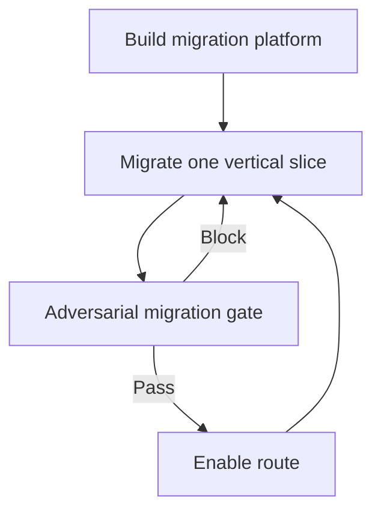

# Prompts

These prompts implement the workflow described in [[Porting Rails Project To DfE|Rails to ASP.NET Core migration strategy]]. Each prompt is deliberately scoped to one migration stage and is designed to produce reviewable evidence.

## Prompt library

| Prompt | Use it when | Primary output |
|---|---|---|
| [[Prompts/Starting Prompt|Build the migration platform]] | Establishing the shared .NET, gateway, container and parity infrastructure | A working migration platform; no migrated business features |
| [[Prompts/Migrate one complete vertical slice|Migrate one complete vertical slice]] | Moving one bounded user journey from Rails to .NET | Evidence, characterisation tests, implementation and differential report |
| [[Prompts/Adversarial migration gate|Run the adversarial migration gate]] | Independently deciding whether a completed slice may receive traffic | An evidence-backed `PASS` or `BLOCK` decision |

## Recommended sequence

1. Run **Build the migration platform** once for the repository.
2. Select one bounded journey and complete **Migrate one complete vertical slice**.
3. Give the result to a different reviewer using **Run the adversarial migration gate**.
4. Enable the route only after `PASS`; otherwise return the listed minimum remediation to the implementer.
5. Repeat from step 2.

> [!tip] Keep the roles separate
> The gate reviewer should not be the agent that implemented the slice. Independence makes it more likely that plausible but incorrect assumptions will be challenged.

## Use guidelines

- Replace every bracketed input before running a prompt.
- Give the agent access to the repository and deterministic local test services.
- Keep one prompt invocation scoped to one stage.
- Preserve execution logs, evidence files and parity reports.
- Treat missing evidence as an unresolved risk, not as permission to infer behaviour.
- Never provide production credentials or production personal data.

## Related notes

- Strategy: [[Porting Rails Project To DfE]]
- Commands: [[Migration platform commands]]
- Agent run journals: [[Logs]]
